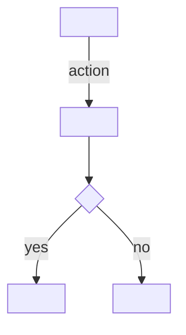

# Requirements doc

Testable specification of what to build and why — PRD or feature spec.
Readers are engineers sizing work and reviewers checking scope. The doc's
job is killing ambiguity before code exists.

## Interview questions

Ask all that are not already answered by context:

1. Problem — what user pain or business need drives this?
2. Users — who is it for? Personas or roles?
3. Goals — what does success look like? Non-goals — what is explicitly out of scope?
4. Functional requirements — what must the system do? Walk the core flows.
5. Non-functional — performance, scale, security, compliance, accessibility?
6. Constraints — deadlines, existing systems, budget, tech stack mandates?
7. Open questions — what is undecided? Naming them now is a feature of the doc.
8. Success criteria — how will we measure it worked?

## Template

````markdown
# Requirements: <feature/system name>

| Field | Value |
|-------|-------|
| Status | Draft / Review / Approved |
| Author | <name> |
| Date | YYYY-MM-DD |

## Background
<The problem: who hurts, how much, why now. 2-4 sentences. Link prior art.>

## Goals
<Numbered. Each is measurable or clearly checkable.>

## Non-goals
<Explicit exclusions. Prevents scope creep and future "I thought it did X".>

## Users
<Roles/personas and what each needs from this.>

## Functional requirements
<Numbered, testable statements. "The system MUST/SHOULD/MAY ...".
Each requirement is verifiable — a reviewer can write a test for it.
Group by flow or component if the doc is large.>

| ID | Requirement | Priority |
|----|-------------|----------|
| FR-1 | The system MUST <behavior> | Must |

<Diagram the primary flow in Mermaid — `flowchart` for logic,
`sequenceDiagram` for multi-actor interaction — whenever a requirement
involves more than one step or actor:>



## Non-functional requirements

| ID | Requirement | Target |
|----|-------------|--------|
| NFR-1 | <performance/scale/security/...> | <measurable target> |

## Constraints
<Hard limits: deadlines, mandated tech, existing systems to integrate.>

## Open questions
<Undecided items, each with who decides and by when if known. `TODO:` is
fine — an honest open question beats a guessed answer.>

## Success criteria
<How we know it worked post-launch: metrics, thresholds, review date.>
````

## Quality bar

- Every functional requirement is testable — "fast" fails, "<200ms p95"
  passes. Rewrite vague words (fast, easy, intuitive, robust) into numbers
  or observable behavior.
- MUST/SHOULD/MAY carry their RFC-2119 meaning — do not use them loosely.
- Non-goals exist and are real — if the user cannot name one, probe: the
  most common scope fight is over something nobody wrote down.
- Requirements describe *what*, not *how* — implementation detail belongs
  in a design doc, not here. Flag it if the user mixes them.
- Open questions are listed, not hidden — an unwritten unknown becomes a
  wrong assumption in code.
- Diagrams are Mermaid blocks, never ASCII art. If no requirement involves
  a multi-step or multi-actor flow, omit the diagram rather than forcing
  a trivial one.
