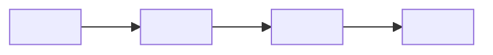

# Root cause analysis

Blameless, factual account of an incident: what happened, why, and what
prevents recurrence. Readers are engineers who were not there and reviewers
checking that prevention is real.

## Interview questions

Ask all that are not already answered by context:

1. What happened — user-visible symptom, when detected, how detected?
2. What was the blast radius — affected users/systems, duration, data loss?
3. Timeline — key events from trigger to resolution (deploys, alerts, mitigations)?
4. Root cause — the technical mechanism, not just "a bad deploy". If unknown, what is suspected?
5. Contributing factors — what made it possible/worse (missing alert, no rollback, config drift)?
6. How was it resolved — immediate fix and who did what?
7. Action items — prevent / detect / mitigate, with owners if known?
8. Severity/incident level, if the org uses levels?

## Template

````markdown
# RCA: <short incident title>

| Field | Value |
|-------|-------|
| Date | YYYY-MM-DD |
| Severity | SEV-n / level |
| Duration | <detect→resolve> |
| Status | Draft / Final |
| Authors | <names> |

## Summary
<2-3 sentences: what broke, who/what was affected, current state.>

## Impact
<Blast radius: users, systems, revenue/data loss, duration. Quantify.>

## Timeline
All times <timezone>.

| Time | Event |
|------|-------|
| HH:MM | <trigger: deploy/config change/traffic spike> |
| HH:MM | <detection: alert/report> |
| HH:MM | <mitigation steps> |
| HH:MM | <resolved> |

## Root cause
<The mechanism: what failed and why it produced the symptom. Trace the
causal chain to the deepest actionable level — "deploy broke it" is a
trigger, not a root cause. Render the chain as a Mermaid flowchart so the
logic is checkable at a glance:>



## Contributing factors
<Conditions that allowed or amplified the incident: missing tests/alerts,
unsafe defaults, process gaps.>

## Detection
<How it surfaced and how fast. If a user reported it before an alert fired,
that is a detection gap — say so.>

## Resolution
<What restored service. Distinguish mitigation (stopped the bleeding) from
fix (removed the cause).>

## Action items

| # | Action | Type | Owner | Due |
|---|--------|------|-------|-----|
| 1 | <item> | Prevent / Detect / Mitigate | <owner> | <date> |

## Lessons learned
<What went well, what was lucky, what would have helped. Blameless —
name systems and processes, not people.>
````

## Quality bar

- Root cause is a mechanism, not an event. Test: could you fix it with one
  action item? If the fix is "be more careful", dig deeper.
- The causal chain is a Mermaid `flowchart`, not ASCII arrows — Mermaid
  renders in every doc viewer, ASCII art does not.
- Timeline is sourced (logs, alerts, deploy history), not reconstructed
  from memory alone.
- Every action item has a type and, ideally, an owner. "Prevent" items map
  to the root cause; "Detect"/"Mitigate" items map to contributing factors.
- Blameless throughout — the failure is in the system, not the operator.
