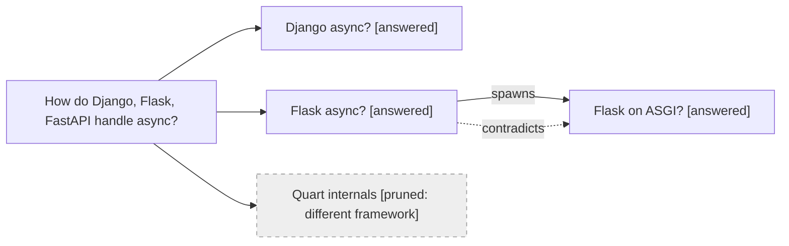

# Research

Answer research questions as a graph of thoughts: ask the user how to
execute, decompose into sub-questions, explore branches with research
agents, merge, score, prune — then ship a cited markdown report plus the
graph. Explicit coverage beats a linear search, where the first promising
thread eats the budget and unchecked paths go unrecorded.

Keep every artifact telegraphic — graph labels, branch findings, and report
prose all cost tokens. Short labels, claim lines, bullets. No narrative.

## Loop

1. **Root** — one sentence: what is true when answered. Sharpen a vague ask
   first.
2. **Ask execution** — before decomposing, ask the user how to run it. One
   ask covering all three, not a drip-feed (use the harness's question tool
   if it has one):
   - *Mode* — `parallel` (default): one research subagent per branch,
     launched same turn / `sequential`: same contract, one at a time /
     `inline`: no subagents, you read
   - *Breadth* — how many branches to fan out (suggest 3-5)
   - *Depth* — `quick` (1-2 primary sources per branch) / `standard` /
     `deep` (follow secondary threads)

   Fan-out spends the user's tokens and wall-clock time — they pick the
   trade-off, not you. No usable answer (skipped, non-interactive run, no
   question tool) → defaults: parallel, ~4 branches, standard.
3. **Decompose** — independent *angles* (mechanism, status, edge cases,
   alternatives), not steps, sized to the chosen breadth. "And then" = a
   chain, not a branch — fold it. A focused question may honestly be 1-2
   nodes; don't inflate just because agents are available.
4. **Plan check** — show the branch list telegraphically (one line each)
   plus the chosen mode; the user confirms, prunes, or adjusts before
   anything launches. No way to ask → proceed.
5. **Explore** — per the chosen mode. Primary sources only: official docs,
   source code, specs, first-party APIs, papers. A blog citing the docs is
   a pointer to the docs, not a source. Per node record
   `claim — source URL — strong|weak` (`strong` = primary + corroborated;
   `weak` = single or secondary only).
6. **Grow** — findings mutate the graph:
   - new question → spawn a child node
   - conflict with another branch → `contradicts` edge; resolve by source
     authority or flag unresolved — never average two conflicting claims
   - two branches reach the same claim → merge into one node

   Cap the graph at ~12 nodes. Past that, expand only if a branch is needed
   to answer the root — more nodes cost tokens without buying coverage.
   Follow a branch until it answers, dead-ends, or stops mattering to the
   root; then mark it and move on.
7. **Score** — verdict per node: `answered` / `weak` / `pruned` + reason.
   Pruned nodes stay in the graph — silent pruning hides coverage holes.
8. **Synthesize** — write the report.

## Branch contract

Subagent or not, a branch reports back the same way — telegraphic, ≤10
finding lines (≤5 on quick depth). Use the `subagent-manager` brief format
if available:

```
Node: <sub-question>
Findings: claim — primary source URL — confidence
New questions: <child-node candidates, or none>
Contradictions: <conflicts, or none>
```

`New questions` feeds step 6 — evaluate each before aggregating. You keep
the graph and run grow/score/synthesize; branches never see each other's
work.

## Report

Save one markdown file where the repo keeps research notes (match
convention; else `docs/research/` or ask). Sections:

1. **Answer** — the direct answer, first.
2. **Findings** — `claim — source URL — confidence` lines grouped by
   sub-question. No restating the question, no transitions.
3. **Thought graph** — mermaid; node labels = compressed sub-question +
   `[verdict]`; edges `spawns` / `merges` / `contradicts`; pruned nodes
   marked (`:::pruned` class or `[pruned]` in label).
4. **Pruned branches** — what was dropped and why, one line each.
5. **Open questions** — discovered but unexplored, one line each.

~600 words of prose is plenty for most questions. Example graph:



## Anti-patterns

- **Chain-as-graph** — sequencing dressed as branches.
- **Silent fan-out** — agents launched before the plan check; the user
  never saw what they're paying for.
- **Ask-spam** — mode, breadth, and depth are one ask; three separate
  questions is a drip-feed.
- **Silent pruning** — a dropped branch nobody can see is a coverage hole.
- **Averaging contradictions** — "some say X, some say Y" without resolving
  authority.
- **Source laundering** — citing the blog that cited the docs.
- **Graph theater** — nodes nobody needed.
- **Report padding** — restating the question, narrative filler, sources
  listed twice.
